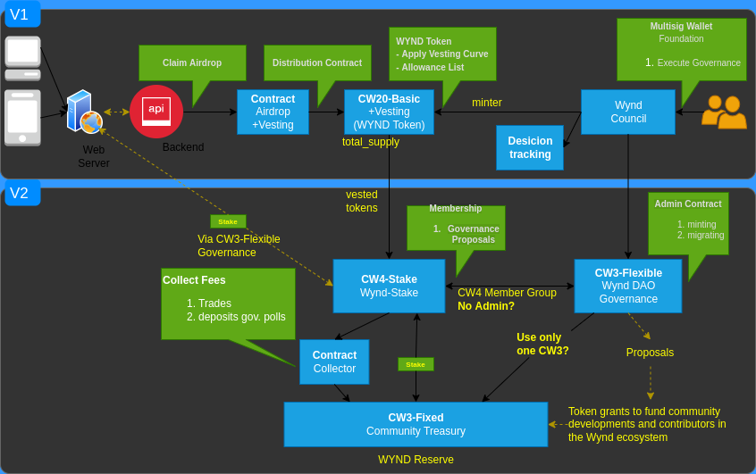

# Wynd Contracts

This maintains core contracts and helpers for the Wynd Protocol.

## Architecture

### V1 Launch Design

V1 Arhitecture aims to set up an initial contract configuration for the WYND Foundation to provide a way to airdrop tokens based on scheduled curves.


### V2 Staking and Governance

V2 Architecture aims to provide a way to stake the vested tokens and to set up governance contracts.



## Contracts

`cw20-vesting` - A fork of `cw20-base` extends to support vesting accounts, that hold tokens
that are slowly released over time.

`cw20-vesting-airdrop` - A fork of `cw20-merkle-airdrop` that works very similar, but allows a vesting schedule to be
set for each stage of the airdrop. It also allows the owner to "claw back" unclaimed tokens after the end rather than
burning them, inspired by the Osmosis airdrop.

`wynd-decisions` - This records an immutable record of decisions made by a group. It can be used by any account,
but is designed for a multisig contract to vote on "Text Proposals"

`wynd-stake` - A fork of `cw4-stake` customized to our use cases. Main additions: handle delegations from cw20-vesting,
support multi-timeframe bonding, easy support for immediately liquid rewards.

## Building contracts

```shell
docker run --rm -v "$(pwd)":/code \
  --mount type=volume,source="$(basename "$(pwd)")_cache",target=/code/target \
  --mount type=volume,source=registry_cache,target=/usr/local/cargo/registry \
  cosmwasm/workspace-optimizer:0.12.7

git add -f artifacts
```

Note use `workspace-optimizer-arm64` if on a Mac M1
